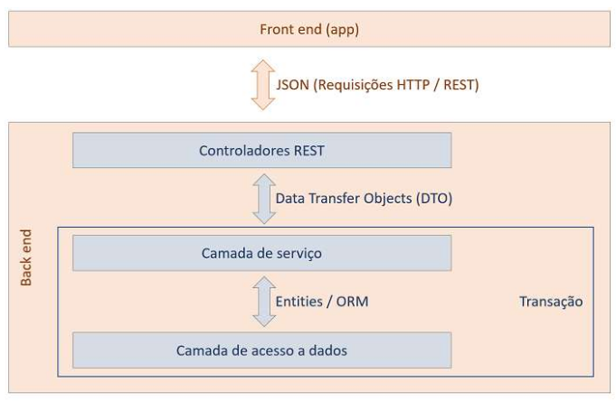

# Projeto DSList

>:warning: O projeto foi desenvolvido no intensivão Java Spring que ocorreu durante a data 11/11 até 17/11, realizada pela <a href ="https://devsuperior.com.br/"> escola DevSuperior</a>.

## Finalidade do projeto
O projeto visa colocar em pática conceitos do ecossistema Spring, com estruturação de projeto Spring Rest adotando padrão REST para a API web, realizando uma arquitetura de padrões de camadas e padrão DTO persistindo em um banco de dados.

## Descrição

O projeto é uma aplicação voltada para o back-end, o sistema disponibiliza um catálogo de jogos que trazem informações como títulos de cada jogo, ano de lançamento, gênero, plataformas que rodam o jogo, pontuação, descrição curta do jogo, descrição longa do jogo, realizando buscas por cada jogo obtendo o detalhamento do mesmo, buscando listas de jogos por categorias, desenvolvido sobre os padrões de camadas e aplicando padrão DTO (Data Transfer Object) para a transferência de dados entre camadas de uma aplicação melhorando a performance da API. A persistência de dados é realizada por um base de dados local como o H2 Database, usando Database Seeding para carregamento dos dados, consulta SQL, projection, para testar os serviços foi usado o Postman.

## Padrão de camadas
<h1 align="center">

</h1>

## Modelo de domínio DSList

<h1 align="center">

</h1>
